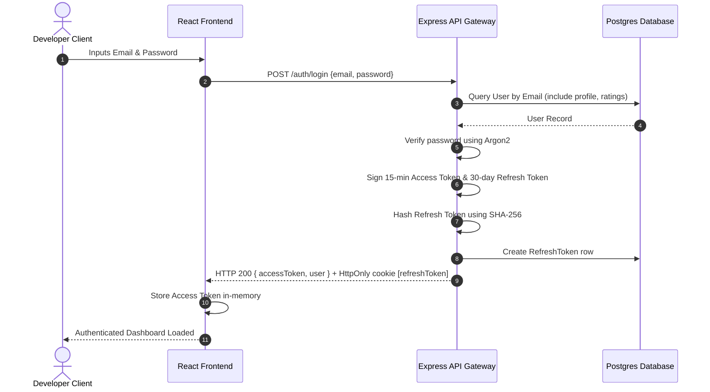
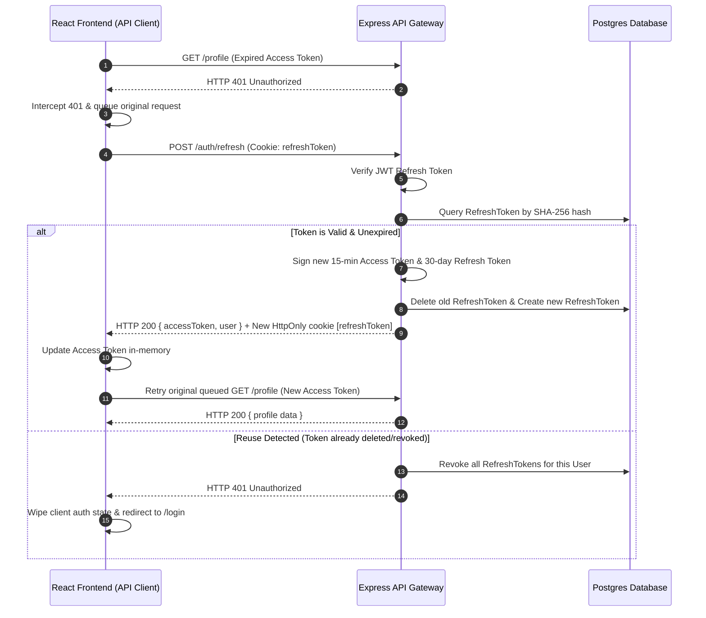

# Authentication Documentation — Phase A Complete

This document outlines the authentication architecture, token lifespans, API endpoints, flows, error codes, and folder structures implemented during Phase A.

---

## 1. Authentication Architecture

The application implements a production-grade, stateless **JWT (JSON Web Token)** authentication system.

- **Dual-Token System**:
  - **Access Token**: Short-lived, stored only in client memory. Used to authorize requests via the HTTP `Authorization: Bearer <token>` header.
  - **Refresh Token**: Long-lived, stored in a secure, server-side `HttpOnly` cookie. Hashed in the database to prevent session interception and allow manual revocation.
- **Refresh Token Rotation (RTR)**: Every time the client requests a new access token using `/auth/refresh`, the refresh token itself is rotated (invalidated, and a new one is set).
- **Automatic Reuse Detection**: If a client attempts to use a refresh token that has already been rotated (indicating a replay attack), the system automatically revokes **all** active sessions for that user.
- **Multiple-Device Support**: A user can maintain multiple concurrent sessions across different browsers/devices. Only the active refresh token for the specific device is rotated or deleted upon logout.

---

## 2. Token Details & Lifespans

| Token Type | Lifespan | Storage Location | Transmission Method | Database Hashing |
| :--- | :--- | :--- | :--- | :--- |
| **Access Token** | 15 Minutes | In-Memory (React state) | `Authorization` Bearer Header | No |
| **Refresh Token** | 30 Days | `HttpOnly` cookie | `Cookie: refreshToken` Header | Yes (SHA-256) |

### Cookie Parameters (Refresh Token)
- `httpOnly: true` (Prevents XSS extraction)
- `secure: true` (Forced in Production environment over HTTPS)
- `sameSite: "strict"` in production, `"lax"` in development (Mitigates CSRF)
- `maxAge: 30 * 24 * 60 * 60 * 1000` (30 days)

---

## 3. System Flows & Sequence Diagrams

### 3.1 Initial Login Flow


### 3.2 Silent Token Refresh & Replay Attack Prevention


---

## 4. API Endpoint Contract Reference

### `POST /auth/register`
Creates user record, initializes profile, generates an email verification UUID token, and logs the simulated URL.
- **Request Body**: `{ username, email, password }`
- **Response (201)**: `UserDTO`

### `POST /auth/login`
Validates credentials, establishes cookies, returns user and access token.
- **Request Body**: `{ email, password }`
- **Response (200)**: `{ accessToken, user: UserDTO }`

### `POST /auth/logout`
Deletes the specific session's refresh token from the database and clears cookies.
- **Request Cookies**: `refreshToken`
- **Response (200)**: `{ message: "Logged out successfully" }`

### `POST /auth/refresh`
Rotates refresh tokens and returns a new access token.
- **Request Cookies**: `refreshToken`
- **Response (200)**: `{ accessToken, user: UserDTO }`

### `GET /auth/me` (Protected)
Retrieves the logged-in user details.
- **Headers**: `Authorization: Bearer <token>`
- **Response (200)**: `UserDTO`

### `POST /auth/verify-email`
Verifies user email verification token.
- **Request Body**: `{ token }`
- **Response (200)**: `{ message, user: UserDTO }`

### `POST /auth/forgot-password`
Generates a recovery token expiring in 1 hour and prints simulated link to console.
- **Request Body**: `{ email }`
- **Response (200)**: `{ message: "If the email exists, a password reset link has been sent" }`

### `POST /auth/reset-password`
Overwrites the user's password hash and revokes all active device sessions.
- **Request Body**: `{ token, password }`
- **Response (200)**: `{ message: "Password reset successfully" }`

---

## 5. Security Protocols & Middlewares

1. **Helmet Middleware**: Activated on all routes to inject security headers (CSP, X-Frame-Options, HSTS, etc.).
2. **CORS Restriction**: Limited origin checks strictly matching `process.env.FRONTEND_URL` (falls back to `http://localhost:5173`).
3. **Argon2 Password Hashing**: Utilizes optimal memory cost ($65536$), time cost ($3$), and parallelism ($4$).
4. **Rate Limiting**: Throttles registration, login, verification, and recovery request thresholds to prevent brute force attacks.

---

## 6. Project Layout & Folder Structures

### Frontend Architecture (`UI/codewar/src/features/auth`)
```text
auth/
├── components/
│   ├── LoginForm.tsx            # Stateful glassmorphic login form
│   └── RegisterForm.tsx         # Signup form with log notifications
├── context/
│   └── AuthContext.tsx          # Session provider & mount token restorer
├── guards/
│   └── ProtectedRoute.tsx       # Route guard with glowing LoadingScreen
├── hooks/
│   └── useAuth.ts               # Custom context consumption hook
├── pages/
│   ├── Login.tsx
│   ├── Register.tsx
│   ├── ForgotPassword.tsx
│   ├── ResetPassword.tsx
│   └── VerifyEmail.tsx          # Handles verification status loading
├── services/
│   ├── api-client.ts            # Fetch client wrapper with 401 retry queue
│   └── auth.service.ts          # API connector mapping endpoints
└── types.ts                     # UserDTO matches
```

### Backend Architecture (`services/api/src/modules/auth`)
```text
auth/
├── controller/
│   └── auth.controller.ts       # Validates bodies & structures UserDTOs
├── middleware/
│   ├── auth.middleware.ts       # JWT verify gateway middleware
│   └── rate-limiter.middleware.ts # Throttles auth endpoints
├── repository/
│   └── auth.repository.ts       # Eager-loads profile/ratings tables
├── routes/
│   └── auth.routes.ts           # Wire up routes and validation
├── service/
│   └── auth.service.ts          # Encapsulates logic, hashing, and RTR
├── tests/
│   ├── auth.integration.test.ts # 43/43 Jest tests verified
│   └── auth.unit.test.ts
└── utils/
    ├── argon2.utils.ts
    ├── errors.ts
    └── jwt.utils.ts
```
